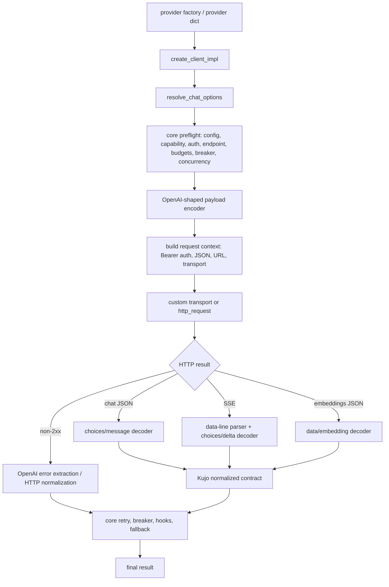

# Kujo AI SDK Provider Driver Fact-Finding

Status: implementation-planning report; no provider-driver refactor is implemented here.  
Evidence date: 2026-08-26.  
Primary evidence: `src/`, tests, schemas, examples, docs, manifests, workflows, and the sibling checkouts for the public `kujolang` GitHub organization. The organization inventory was verified with `gh api --paginate orgs/kujolang/repos`; the empty `trail` repository and the three locally absent repositories were checked separately. Historical release archives and generated evidence were treated as corroboration, not as current consumers.

Evidence labels used below:

- **OBSERVED** — directly verified in source, tests, docs, manifests, or a downstream checkout.
- **INFERRED** — strongly implied by the observed architecture but not guaranteed by a current contract.
- **RECOMMENDED** — a future design choice; not current behavior.

## 1. Executive Summary

**OBSERVED.** The SDK is currently a provider-neutral operational shell wrapped around one hard-coded wire protocol: OpenAI Chat Completions, OpenAI embeddings, and OpenAI-style SSE. Provider presets are dictionaries containing endpoint, model, capability, and optional transport data. `src/ai_sdk.kujo` owns everything else: bearer authentication, payload encoding, HTTP execution, parsing, OpenAI response extraction, normalized Kujo results, retries, deadlines, circuit breaking, fallbacks, governance, concurrency, observability, redaction, endpoint policy, and fixtures.

**OBSERVED.** The public surface is larger than the README's headline list. `src/ai_sdk.kujo` exports low-level normalization, parsing, retry, header, and option helpers in addition to chat and embeddings. `src/model_catalog.kujo` exposes an independently versioned catalog contract. Those exports, the provider/client dictionaries, normalized result fields, streaming events, hook payloads, error codes, and custom transport call shape are compatibility contracts even where no schema currently describes them.

**OBSERVED.** A driver architecture is viable without breaking the current API. Current presets can retain their exact dictionaries and factories while gaining one additive internal `driver` field. A built-in OpenAI-compatible driver can initially delegate to behavior extracted unchanged from `src/ai_sdk.kujo`. Existing custom transports remain a transport override, not a driver substitute.

**RECOMMENDED.** Introduce the smallest useful driver contract: validation/metadata, auth contribution, operation encoding, and operation decoding (including stream and provider error decoding). Keep request orchestration, security enforcement, retries, timeouts, deadlines, breakers, fallbacks, budgets, hooks, concurrency, state, redaction, response-size limits, and final Kujo contract assembly in core. Do not add global registration. External Kennel packages should construct ordinary provider dictionaries with a versioned driver function bundle; the AI SDK should validate the bundle and use a built-in OpenAI-compatible driver when `driver` is absent.

The highest compatibility risks are:

1. moving security checks into untrusted external drivers;
2. changing the custom transport signature or `Ok`/`Err` expectations;
3. altering normalized fields or error codes consumed by Agents SDK, Dispatch, Relay, AI Chat, Tribunal, RAG, and Kujo workflows;
4. changing stream callback ordering or `delta`/`done`/`error` shapes;
5. treating driver capabilities as permission to bypass endpoint, header, response-size, or redaction policy;
6. coupling the driver contract to only Anthropic, Ollama, or OpenAI Responses rather than provider-neutral operations.

No unavoidable breaking change was found. The architecture can be introduced as an additive minor SDK release while retaining normalized contract version `1.0.0`, provided existing response semantics remain unchanged. The driver extension contract should have its own version.

## 2. Current Architecture

### 2.1 Shared request path



**OBSERVED.** `src/ai_sdk.kujo` is a 3,475-line cohesive-but-overloaded module. Its operational logic is provider-neutral in intent, while request contexts and decoders are OpenAI-specific. The file should be separated by responsibility only as part of a test-protected extraction, not merely because it is large.

### 2.2 Exact flows

1. **Non-streaming chat.** `chat_completion_impl` → fallback wrapper → `resolve_chat_options` → fixture/config/auth/endpoint/JSON-capability/breaker/concurrency checks → `build_chat_payload_with_resolved` → budgets/governance → `build_chat_request_context` → retry loop → `execute_request_once` → transport → response-size/non-2xx/JSON checks → `normalize_success_response` → structured-output validation → governance accounting → observability/breaker finalization.
2. **Streaming chat.** `chat_completion_stream_impl` copies options and forces `stream=true`, then calls the same `chat_completion_impl`. `execute_request_once` requests `stream_options.include_usage`, accepts transport `_stream_chunks`/`stream_chunks` or a body, parses OpenAI-style SSE in `parse_sse_chunks`/`parse_sse_lines`, and aggregates in `normalize_stream_success_response`. After the entire request completes, the wrapper replays text as callback `delta` events (using decoded chunks or word chunks), then a `done` event; failure emits one `error` event. This is buffered streaming, not a live incremental transport callback.
3. **Embeddings.** `embeddings_impl` has parallel fallback/config/capability/auth/endpoint/governance/retry logic → `build_embeddings_payload_with_resolved` → `build_embeddings_request_context` → `execute_embeddings_request_once` → OpenAI JSON/error parsing → `normalize_embeddings_success_response`.
4. **Fixture/offline.** Chat and embeddings execute their normal option, budget, capability, structured-output, and governance checks, then return deterministic `fixture_response_impl` or `fixture_embeddings_response_impl`; no API key or network is required.
5. **Custom transport.** `resolve_transport_with_resolved` prefers `options.transport`, then `client.transport` (copied from `provider.transport`), then `http_request`. Core calls it as `transport(url, request_options)` with `method`, timeout fields, `_headers`, and `_body`; it must return Kujo `Ok(response)` or `Err(error)`. Core still owns response parsing and normalization.
6. **Fallback providers.** Chat and embeddings recursively call their primary operation with `_fallback_disabled=true`. A fallback entry can be a provider directly or `{provider, api_key, options}`. Only retryable primary/fallback failures advance. Successful or terminal fallback results gain `fallback: {used, index, provider}`.

## 3. Source File Responsibility Map

| File | Responsibility and important symbols | Public? | Dependencies / consumers | Compatibility risk |
|---|---|---:|---|---|
| `src/ai_sdk.kujo` | Provider metadata, clients/messages, options, payloads, redaction, endpoint policy, errors, fixtures, OpenAI decoders, governance, embeddings, SSE, retry/header/hooks/deadline/breaker/concurrency/fallback orchestration | Yes; 22 exports | All SDK users; direct low-level contract tests | Critical |
| `src/providers.kujo` | OpenAI/OpenRouter/DeepSeek presets; custom OpenAI-compatible endpoint validation | Yes; 5 exports | README, AI Chat, Relay, Tribunal, workflows | Critical |
| `src/model_catalog.kujo` | Versioned model metadata/catalog creation, validation, hashing, lookup | Yes; 8 exports | Dispatch routing, scripts, tests | High |
| `schemas/contracts/1.0.0/*.json` | Machine-readable chat success, embedding success, error shapes | Public artifacts | Release schema gate and external validators | Critical |
| `tests/sdk_contract_tests.kujo` | Baseline public chat/provider/header/normalizer/stream callback contract | Test | Core regression gate | Critical |
| `tests/sdk_contract_embeddings_tests.kujo` | Embedding wire/normalized/fallback/governance/transport contract | Test | Core regression gate | Critical |
| `tests/sdk_contract_resilience_tests.kujo` | Defaults, retry/deadline/breaker/budgets/concurrency/hooks/stream/parser/security | Test | Core regression gate | Critical |
| `tests/reliability_failure_modes_tests.kujo` | Failure classification and bounded operational behavior | Test | Release gate | High |
| `tests/security_redaction_tests.kujo` | Recursive sensitive-field redaction and preservation of token-count fields | Test | Security gate | Critical |
| `tests/parser_fuzz_smoke_tests.kujo` | Malformed JSON/SSE/header/parser behavior | Test | Parser safety gate | High |
| `tests/bugfix_regression_tests.kujo` | Previously fixed endpoint/provider edge cases | Test | Regression gate | High |
| `tests/feature_smoke_tests.kujo` | Public feature availability | Test | Release gate | High |
| `tests/model_catalog_tests.kujo` | Catalog normalization/hash/validation/lookup | Test | Dispatch compatibility | High |
| `tests/live_provider_smoke_tests.kujo` | Opt-in live OpenAI-compatible check | Test | Release evidence when credentials exist | Medium |
| `examples/*.kujo` | Copyable public usage, routing preference, production profile, telemetry hooks | Public examples | Users and documentation | High |
| `docs/API_CONTRACT_POLICY.md` | Semver rules for normalized responses and catalog | Public policy | Release decisions | Critical |
| `docs/ARCHITECTURE_DATA_FLOW.md` | Current request flow | Public docs | Maintainers | High |
| `docs/BUILD_YOUR_FIRST_PROVIDER.md`, `docs/PROVIDER_EXTENSION_GUIDE.md` | Current custom OpenAI-compatible extension story | Public docs | Provider authors | High |
| Other `docs/*.md` and `README.md` | Adoption, compatibility, operations, telemetry | Public docs | Users | Medium–High |
| `scripts/release_quality_gates.sh` | Aggregated release validation | Tooling | CI/release workflow | Critical |
| `scripts/verify_contract_schemas.sh` | Schema fixture validation | Tooling | Release gate | Critical |
| `scripts/benchmark_quality_gate.kujo`, `stress_harness.kujo` | Quality/performance and concurrency/reliability evidence | Tooling | Release gate | High |
| `kennel.toml`, `kujo.toml` | Package identity, exports, entry point | Public package metadata | Kennel consumers | Critical |
| `.github/workflows/*.yml` | CI, compatibility matrix, release validation, artifact guard | Automation | Merge/release | High |

## 4. Public API Inventory

### 4.1 `src/ai_sdk.kujo`

| Export | Arguments | Contract / side effects |
|---|---|---|
| `provider_supports` | `(provider, capability_key)` | Boolean; false for malformed/missing capability. |
| `provider_metadata` | `(provider)` | Safe metadata dictionary; excludes secrets and transport. |
| `resolve_model_preference` | `(provider, preference)` | Deterministic `{ok, provider, model, preference_class, source, requested_preferred, fallback_requested}` or `invalid_model_preference`. |
| `create_client` | `(provider, api_key_override)` | Returns mutable client; reads `env(provider.api_key_env)` when override is null. |
| `create_message` | `(role, content)` | Returns `{role, content}`; callers may add fields. |
| `build_chat_payload` | `(client, messages, options)` | OpenAI-shaped payload; options include tools and response format. |
| `standard_error_response` | `(client, error_code, message, status_code, raw, retryable)` | Normalized, redacted error. |
| `normalize_provider_error` | `(client, status_code, data)` | Extracts OpenAI `error` object; additive type/param/provider_code. |
| `parse_json_contract` | `(text)` | `{ok, data, error}`, never throws parse errors outward. |
| `parse_sse_contract` | `(body_text)` | Array of parsed `data:` JSON objects; stops at `[DONE]`. |
| `parse_sse_chunks_contract` | `(chunks)` | Chunk-boundary-tolerant equivalent. |
| `should_retry_error_result` | `(result)` | Retry decision based on normalized error/status. |
| `retry_delay_contract` | `(attempt, base_delay_ms, max_delay_ms, jitter_window_ms)` | Bounded exponential delay with deterministic/runtime jitter behavior. |
| `sdk_contract_version` | `()` | `"1.0.0"`. |
| `merge_headers_for_request` | `(default_headers, extra_headers, allow_protected_override)` | Merges case-insensitively; protects Authorization/Content-Type and drops CR/LF entries. |
| `normalize_non_stream_success` | `(client, status_code, data, fallback_model)` | OpenAI chat object → normalized chat success. |
| `normalize_stream_success` | `(client, status_code, stream_events, fallback_model)` | OpenAI stream event array → normalized chat success. |
| `resolve_options` | `(client, options)` | Full resolved option dictionary. |
| `sdk_default_limits` | `()` | Returns the defaults listed in §8. |
| `chat_completion` | `(client, messages, options)` | Mutable client counters/state; transport/network/hooks/sleep; normalized result. |
| `chat_completion_stream` | `(client, messages, options, on_event)` | Same request plus buffered callback replay and `emitted_events`. |
| `embeddings` | `(client, input, options)` | Parallel normalized embedding operation. |

### 4.2 `src/providers.kujo`

- `openai_provider()`
- `openrouter_provider()`
- `deepseek_provider()`
- `custom_openai_compatible_provider(base_url, api_key_env, default_model)`; localhost HTTP opt-in also reads `KUJO_AI_SDK_ALLOW_INSECURE_LOCALHOST`.
- `custom_openai_compatible_provider_with_options(base_url, api_key_env, default_model, allow_insecure_localhost)`.

### 4.3 `src/model_catalog.kujo`

- `model_catalog_contract_version()` → `"1.0.0"`.
- `create_model_metadata(provider_id, model_id, options)` → normalized metadata entry.
- `create_model_catalog(catalog_id, version, models, metadata)` → sorted, hashed, validated catalog.
- `create_model_catalog_from_config(config)` → `{ok, catalog, errors}`.
- `provider_model_catalog(catalog_id, version, providers)` → catalog derived from provider presets.
- `validate_model_catalog(catalog)` → `{ok, errors[]}`.
- `model_catalog_hash(catalog)` → SHA-256 of canonical identity/models/metadata, excluding validation and stored hash.
- `resolve_model_catalog_entry(catalog, provider_id, model_id)` → entry plus catalog identity/hash or `invalid_model_catalog` / `model_not_in_catalog`.

**RECOMMENDED.** Treat all 35 exports as public until an explicit deprecation audit proves otherwise. The README currently omits many low-level `ai_sdk` exports; omission is not evidence of privacy because they are explicitly exported and directly tested.

## 5. Provider Contract

### 5.1 Fields actually read

| Field | Current meaning | Readers | Requirement |
|---|---|---|---|
| `name` | Provider ID in results, traces, fallback metadata, state namespace | Core, examples, downstream bridges | Effectively required non-empty string |
| `base_url` | Endpoint prefix and host-policy input | Core request contexts/metadata | Required for live calls |
| `chat_path` | Chat suffix | Core; metadata default only | Required by live chat today; presets set it |
| `embeddings_path` | Embedding suffix | Core, default `/embeddings` | Optional with default |
| `api_key_env` | Credential environment variable and auth error text | Client creation/core/examples | Required under bearer model; may be empty in future no-auth drivers |
| `default_model` | Default chat/embedding model and resolver fallback | Options, fixtures, catalog | Required non-empty |
| `supported_models` | Preference compatibility and catalog fallback | Resolver/catalog | Optional array |
| `models` | Rich provider model entries | Metadata/catalog | Optional array |
| `model_preferences` | Class-to-model routing map | Resolver/metadata | Optional dictionary |
| `capabilities` | `streaming`, `tool_calls`, `json_mode`, `embeddings` booleans | Core/catalog/metadata | Optional dictionary; absent means unsupported |
| `transport` | Per-provider callable | Client creation | Optional function |
| `validation_error` | Deferred provider configuration failure | Client/core/metadata | Optional string |

Presets use only the fields above. `provider_metadata` returns `name`, `base_url`, derived `host`, `chat_path`, `embeddings_path`, `default_model`, `api_key_env`, `capabilities`, `model_preferences`, `models`, and `validation_error`; it deliberately excludes `api_key`, `supported_models`, and `transport`.

**Compatibility note.** Provider dictionaries are structurally open. Tests and downstream bridges mutate `name`, `transport`, and capabilities directly. A new `driver` field is additive, but core must continue accepting legacy providers with no driver.

## 6. Client Contract

`create_client` returns:

```text
provider
api_key
config_error
transport
in_flight_requests
circuit_breaker_consecutive_failures
circuit_breaker_open_until_ms
```

Core later adds/mutates `trace_sequence`, `governance_tokens_used`, and `governance_cost_cents_used`. State may instead be read/written through an option-supplied `state_backend` (`get`/`set` callable dictionary) keyed by state namespace and provider.

**OBSERVED.** Examples read `client.api_key`; tests mutate breaker and in-flight fields. Fallback creation reuses `client.api_key` by default. Therefore the dictionary remains compatibility-sensitive even though most consumers should treat it as opaque.

**RECOMMENDED.** Add `driver` only as an internal/additive client field resolved from the provider. Do not remove, rename, or repurpose existing fields. Never expose resolved credentials through `provider_metadata` or driver metadata.

## 7. Normalized Response Contracts

### 7.1 Chat success

Required schema fields are `ok:true`, `provider`, `contract_version`, `request_id`, `model`, `output_text`, `finish_reason`, `tool_calls`, `usage:{input_tokens,output_tokens,total_tokens}`, `status_code`, `normalized_at`, and redacted `raw`. Runtime may add `observability` and `fallback`; streaming wrapper adds `emitted_events`.

### 7.2 Streaming

The final return is the chat success/error contract plus `emitted_events`. Callback events are:

- `{type:"delta", delta:string, done:false}` zero or more;
- `{type:"done", delta:"", done:true, result:{ok,status_code,request_id,finish_reason}}` exactly once after success;
- `{type:"error", error:<normalized error>, done:true}` exactly once after request failure.

A callback exception returns `stream_callback_error` with the events emitted so far. Tool calls are accumulated into the final response but are not emitted as distinct SDK callback event types today.

### 7.3 Embeddings success

Required schema fields are `ok:true`, `provider`, `contract_version`, `model`, `embeddings:[{index,vector}]`, `usage:{input_tokens,total_tokens}`, `status_code`, `normalized_at`, and redacted `raw`. Runtime may add `observability` and `fallback`.

### 7.4 Error

Required fields are `ok:false`, `provider`, `contract_version`, `error:{code,message,retryable}`, `status_code` (0–599), `normalized_at`, and redacted `raw`. Provider errors may add `error.type`, `error.param`, and `error.provider_code`.

Observed core codes: `auth_error`, `circuit_breaker_open`, `concurrency_limit_exceeded`, `concurrency_queue_timeout`, `config_error`, `deadline_exceeded`, `endpoint_policy_violation`, `governance_budget_exceeded`, `http_error`, `internal_error`, `invalid_json`, `invalid_response`, `network_error`, `provider_error`, `request_budget_exceeded`, `response_too_large`, `stream_callback_error`, `structured_output_invalid`, `transport_error`, and `unsupported_feature`.

Retry classification is semantic: 429 and >=500 HTTP statuses retry; explicit retryable transport/provider results retry; auth/config/budget/policy/validation failures do not unless deliberately marked (structured-output validation defaults retryable).

### 7.5 Model catalog

Catalog: `{schema_name:"ai-sdk-model-catalog", schema_version:"1.0.0", id, version, models, metadata, catalog_hash, validation}`.

Model entry fields: `provider`, `model`, `quality_tier`, `relative_quality`, `context_window`, `supports_tools`, `supports_structured_output`, `input_cost_per_million`, `output_cost_per_million`, `currency`, `typical_latency_ms`, `latency_percentile`, `reliability_score`, `enabled`, `source`, `observed_at`, and `metadata`. Unknown operational measurements remain null.

## 8. Operational Behavior Inventory

| Behavior | Classification | Current owner / coupling | Driver treatment |
|---|---|---|---|
| Provider configuration/validation | A/E plus provider-specific pieces | Preset factory and `validation_error` | Driver validates its own config; core validates contract and policy |
| Authentication | B/F | Hard-coded `Authorization: Bearer <api_key>` in request contexts | Driver contributes auth material; core protects/redacts it |
| Chat/embedding request encoding | B/D/F | Hard-coded OpenAI JSON | Driver hook |
| HTTP/custom transport | C/E | Core chooses callable and invokes `url, options` | Keep in core; driver returns request descriptor only |
| Header merge/protection/injection defense | A/E | Core | Must remain core-enforced after driver contribution |
| Endpoint validation/localhost/allowlist | A/E with preset validation | Provider factory + core host policy | Core authority; driver cannot bypass |
| Response/usage/tool decoding | B/D/F | OpenAI `choices`, `message`, `data`, token names | Driver hook returning semantic decode result |
| SSE framing/delta decoding | B/C/D/F | `data:` JSON, `[DONE]`, `choices[].delta` | Driver stream decoder/framer hook; callback contract remains core |
| Error extraction | B/D/F | OpenAI `error` object | Driver maps native error details; core owns Kujo envelope/retry policy |
| Retry budgets/delays/jitter | A/E | Core | Keep core |
| Timeouts/deadlines | A/C/E | Core request options and loop | Keep core; driver may declare transport hints, not override bounds |
| Circuit breaker/half-open | A/E | Core and optional state backend | Keep core |
| Fallback providers | A/E | Core recursion | Keep core; each fallback resolves its own driver |
| Structured output | A/E request semantics + B encoding | Core validates normalized output; OpenAI response_format passes through | Core semantic validation; driver encodes request capability |
| Tool calls | A normalized contract + B wire shape | Payload pass-through and OpenAI extraction/stream merge | Driver encode/decode; core preserves array semantics and budgets |
| Token/cost budgets | A/E | Core estimates/preflights/accounts normalized usage | Keep core |
| Concurrency/queue | A/E | Mutable client + core | Keep core |
| Observability/tracing | A/E | Core hook lifecycle and result metadata | Keep core; may include driver/provider metadata safely |
| Fixtures | A/E plus B fixture shape | Core deterministic normalized fixtures | Keep core generic fixtures; driver contract tests provide wire fixtures |
| Raw response/redaction/size | A/E | Core | Keep core; driver never returns unredacted raw to callers |
| Model preference/catalog | A/E | Core/catalog module | Keep core; drivers/presets supply metadata only |

Legend: A provider-neutral, B OpenAI-specific, C transport-specific, D response-shape-specific, E compatibility-sensitive, F extraction candidate.

Resolved options and defaults currently include: model, temperature `0.2`, max_tokens `400`, stream `false`, max_retries/retry_budget `2`, jitter `0`, base delay `300ms`, delay cap `4000ms`, timeout `45s`, connect `10s`, read `45s`, optional overall/absolute deadline, structured-output schema/retryability, fallbacks, breaker settings, state backend/namespace, prompt/tool/concurrency/queue/token/cost budgets, trace ID, offline fixture, unsafe-header override, transport, three hooks, endpoint allowlist, and raw-response byte limit.

## 9. OpenAI-Specific Assumption Inventory

| Assumption | File / symbol | Public or internal | Extraction / risk |
|---|---|---|---|
| `/chat/completions`, `/embeddings` | providers; request contexts | Provider fields are public | Preserve legacy fields; driver operation endpoints replace internal concatenation (High) |
| Bearer Authorization | both request-context builders | Internal behavior, externally observable | Extract auth contribution; preserve legacy exact header (Critical) |
| JSON POST with `_headers`/`_body` | execute functions | Custom transport contract | Keep transport call shape or shim it (Critical) |
| `model/messages/temperature/max_tokens/stream` | chat payload builder | `build_chat_payload` is public | Built-in driver must preserve byte-equivalent semantic payload (Critical) |
| `stream_options.include_usage` | chat payload builder | Tested behavior | Preserve in OpenAI driver (High) |
| `tools`, `response_format` pass-through | payload builder | Public option behavior | Preserve in OpenAI driver (Critical) |
| `choices[0].message.content/text/content` | success decoder | Low-level normalizer exported | Keep export as OpenAI compatibility helper; driver decode differs (Critical) |
| `message.tool_calls` | success decoder | Normalized output public | Preserve output; wire extraction moves (Critical) |
| `prompt_tokens`/`completion_tokens` and modern token aliases | usage normalizer | Normalized semantics public | Preserve aliases in OpenAI driver; define semantic usage from all drivers (Critical) |
| `{error:{message,type,param,code}}` | provider error normalizer | Exported low-level API | Keep as OpenAI helper; drivers return native details (High) |
| SSE `data:` JSON and `[DONE]` | parse SSE exports | Exported and tested | Preserve exports; do not require all drivers to use them (Critical) |
| `choices[0].delta.content/tool_calls` | stream decoder | Internal wire behavior | Driver hook; preserve aggregate and callbacks (Critical) |
| embeddings `data[].embedding/index` | embedding decoder | Normalized result public | Driver hook (Critical) |
| API key is mandatory for live calls | operation entry points | Externally observable | Legacy driver only; new driver auth policy may allow no-auth/query/signing (High) |

## 10. Ecosystem Consumer Inventory

The audit searched every public repository returned by the organization API, plus copied/adapted code, docs, fixtures, workflows, schemas, and generated configuration. Current direct or structural consumers are:

| Repository | Files | AI SDK usage / relied-on contracts | Risk |
|---|---|---|---|
| `agents-sdk` | `src/agents/ai/adapter.kujo`, `src/agents/streaming/events.kujo`, runner/tests | Callable injection (`client`, `chat_completion_fn`, `chat_completion_stream_fn`); reads `ok`, provider, request_id, model, output_text, tool_calls, usage, status_code, emitted_events, error code/message/retryable; forwards hooks; maps stream `delta` and `done`; maps named error codes | Critical |
| `dispatch` | `sdk_adapter.kujo`, `src/core/routing.kujo`, `src/agents/agent.kujo`, bridges/tests | SDK-shaped results and tools; independent exact `ai-sdk-model-catalog` v1.0.0/hash/model metadata contract; branches on retryable/error codes | Critical |
| `ai-chat` | `bridge_chat.kujo`, JS runtime/tests | Imports provider factories/client/message/chat; serializes normalized result; provider selection and options | High |
| `relay` | `src/ai_bridge.kujo`, `src/adapters.kujo`, tests/workflows | Executes AI SDK bridge from SDK cwd; reads normalized result, usage, request_id, tool_calls; depends on 1 MiB wrapper and transport/header options | Critical |
| `tribunal` | `src/bridges/ai_sdk_bridge.kujo` | Presets, client/message/chat, provider metadata, model preference; attaches resolver evidence | High |
| `rag` | `src/rag_engine.kujo` | Structural callable result; reads non-empty `output_text` | Medium |
| `kujo-workflows` | AI SDK Muzzle benchmark and Watchdog showcase scripts | Direct presets/client/message/chat; reads client API-key state, result status/model/finish/usage/output/error/raw | High |
| `mcp` | `src/make/enrich.kujo` | Generated enrichment/docs references, no direct runtime coupling found | Low |
| `kennel` | package contract docs/index fixtures | Package name/version/export paths | High for manifest/export changes |
| `docs.kujolang.ai`, `kujo-docs`, `kujo-hyperframes`, `agents.kujolang.ai` | AI SDK and integration documentation | Current OpenAI-compatible positioning and examples | Medium |
| `kujo`, `kujo-skills`, `kujo-agents`, `kujo-workflows` | skills/workflows/install or guidance | Command paths, package identity, usage guidance | Medium |
| `watchdog` | proxy/telemetry examples and AI SDK showcase | OpenAI-compatible proxy behavior; telemetry headers and normalized usage | High when validating transport interoperability |
| `workcell`, `eval`, `spec` | integration/config/evidence references | No direct current source import found; orchestration can execute SDK-shaped workloads | Medium/indirect |
| `kujo-prelaunch` | reports, matrices, launch evidence | Historical validation evidence, not a runtime consumer | Low |
| Remaining org repositories | organization-wide source/docs/config search | No current direct or structural AI SDK consumption found | Low, re-scan before implementation merge |

`agents-sdk` specifically maps `network_error`, `provider_error`, `auth_error`, and `http_error` to agent `provider_error`; `deadline_exceeded` to `timeout`; `structured_output_invalid` to itself; and `request_budget_exceeded` / `governance_budget_exceeded` to `budget_exceeded`. Its runner also treats retryable results and status 408/429/5xx as retry candidates. Unknown new SDK error codes currently degrade to `internal_error`, so new driver errors must normalize into the existing taxonomy whenever semantics match.

Dispatch independently validates catalog schema name/version/hash and relies on provider/model identity, quality, tool/structured-output flags, context, cost, latency, reliability, enabled/source metadata, and deterministic sorting/hashing. That contract must not be coupled to a driver's wire protocol.

## 11. Compatibility Matrix

| Contract | Location / consumers | Classification | Recommended treatment |
|---|---|---|---|
| Existing 35 exports/signatures | source, tests, docs, consumers | MUST PRESERVE EXACTLY | Keep wrappers; add APIs only |
| Provider factories and legacy dictionary fields | providers, bridges | MUST PRESERVE EXACTLY | Add implicit built-in driver resolution |
| Client existing fields/mutation | core/tests/examples | MUST PRESERVE EXACTLY | Add fields only |
| Chat/embedding/error schema v1.0.0 | schemas, Agents SDK, Relay | MUST PRESERVE EXACTLY | Driver decodes to semantic data; core assembles same envelope |
| Stream callback event types/order | core, Agents SDK | MUST PRESERVE EXACTLY | Core remains callback owner |
| Error codes and retry meaning | core, Agents SDK, Dispatch | MUST PRESERVE EXACTLY | Driver supplies classification hints; core chooses stable code/retryability |
| Custom transport precedence/signature/result | tests, Relay/Watchdog | MUST PRESERVE EXACTLY | Keep adapter shim if request descriptor changes |
| Option keys/defaults and hooks | core, Agents SDK, examples | MUST PRESERVE EXACTLY | Resolve centrally before driver invocation |
| Raw data content | normalized results | CAN CHANGE INTERNALLY IF SHIMMED | Preserve redaction and legacy OpenAI raw shape for legacy driver |
| Additive `driver`/driver metadata | provider/client | CAN EXTEND ADDITIVELY | Version and validate |
| Additive capability keys | provider/catalog | CAN EXTEND ADDITIVELY | Preserve old booleans and false-on-missing behavior |
| Internal function/file placement | `src/ai_sdk.kujo` | SAFE TO REFACTOR | Only behind unchanged exports/tests |
| Global `STATE_BACKEND_REGISTRY` implementation | core | CAN CHANGE INTERNALLY IF SHIMMED | Preserve keys/behavior |
| README's claim that all providers are OpenAI-compatible | docs | DEPRECATED / INCOMPLETE after drivers | Update when feature ships |
| Direct external use of omitted low-level exports | organization-wide search found tests but no downstream runtime use | UNKNOWN | Treat as public until formal deprecation |

## 12. Proposed Provider Driver Contract

**RECOMMENDED.** Use a plain Kujo dictionary of functions. This matches current provider/custom transport idioms, avoids registration/global state, and is easy for Kennel packages to construct and inspect.

```kujo
driver := {
    "contract": "ai-sdk-provider-driver",
    "version": "1.0.0",
    "id": "anthropic-messages",

    # Required, pure descriptions/validation.
    "describe": func(provider) { ... },
    "validate": func(provider) { ... },

    # Required per supported operation. Return a request descriptor, not I/O.
    "encode_chat": func(context) { ... },
    "decode_chat": func(context) { ... },

    # Optional when the capability is supported.
    "encode_embeddings": func(context) { ... },
    "decode_embeddings": func(context) { ... },
    "decode_stream": func(context) { ... },
    "decode_error": func(context) { ... }
}
```

Core-to-driver encode context should contain only normalized inputs: operation, provider metadata, model, messages/input, relevant feature options, and a credential handle/value scoped to the call. The encoder returns a bounded descriptor such as `{url, method, headers, body, stream_mode, transport_hints}`. Core then validates URL/host/scheme, merges protected headers, applies limits/timeouts, selects transport, and executes.

Decode hooks receive status, response headers/body or bounded chunks, fallback model, and operation. They return a semantic intermediate result, not the final public envelope:

```text
success: {ok:true, request_id, model, output_text/tool_calls/embeddings,
          finish_reason, usage, raw_provider}
error:   {ok:false, category, message, provider_code, type, param,
          retry_hint, raw_provider}
```

Core validates this shape, applies redaction, decides stable Kujo error code/retryability, enforces governance/structured output, adds timestamps/status/provider/contract/observability/fallback, and returns the existing public result.

Required hooks should be operation-paired. A driver that claims `embeddings` must provide both encode/decode embeddings hooks; a driver claiming streaming must provide stream decoding. `decode_error` may be optional with a conservative HTTP fallback. `describe` should be pure and secret-free. Auth need not be a separate public hook initially: the request encoder can build provider-native auth from an explicitly supplied auth context, while core remains responsible for secret acquisition, protected-header policy, and redaction. Split `resolve_auth` later only if multiple operations prove duplicated.

Do not add `execute` to the driver contract. It would let driver packages bypass timeouts, allowlists, response limits, retries, and telemetry. Do not add global registration: it creates hidden process state, name collisions, and load-order behavior without solving a current need.

## 13. Responsibility Matrix

| Responsibility | AI SDK core | Provider driver | OpenAI-compatible driver | External provider package | Transport | Application |
|---|---:|---:|---:|---:|---:|---:|
| Stable Kujo request/result semantics | Own | Implement hook contract | Adapt OpenAI wire | Supply adapter | — | Consume |
| Retry/deadline/breaker/fallback | Own | Hint only | — | — | Enforce per-call timeout primitive | Configure |
| Budgets/governance/concurrency/state | Own | — | — | — | — | Configure |
| Endpoint/header/redaction/size security | Own/enforce | Contribute bounded descriptor | Contribute | Contribute | Cannot bypass | Configure allowlist |
| Auth acquisition/protection | Own policy | Encode provider scheme | Bearer | Native scheme | Carry headers/query safely | Supply credentials |
| Wire request/response/error/stream | Validate boundary | Own | Own OpenAI forms | Own native forms | Move bytes | — |
| Capabilities/models | Validate/expose | Describe | Describe OpenAI compatibility | Author facts | — | Query/select |
| Public provider factory | Accept | — | Back presets | Expose package factory | — | Call |
| Observability | Own lifecycle | Optional safe metadata | — | — | Timings/status inputs | Hook |

## 14. OpenAI-Compatible Driver Migration

1. Add a private built-in OpenAI-compatible driver whose functions initially wrap the existing payload, request descriptor, JSON, error, embeddings, and SSE logic without changing it.
2. Resolve this driver whenever a provider has no `driver`. This preserves hand-written legacy dictionaries and every current provider factory.
3. Optionally add `driver` to preset dictionaries only after the implicit path is proven; keep every existing field because callers and metadata/catalog logic read them.
4. Keep `build_chat_payload`, `normalize_non_stream_success`, `normalize_stream_success`, `normalize_provider_error`, and SSE parser exports as compatibility wrappers around the built-in driver helpers.
5. Preserve custom transport precedence and exact request-options shape. The driver supplies the descriptor; core adapts it to the legacy transport call.
6. Preserve fixture normalized values, retry counts, hook counts, stream replay, redaction, and raw OpenAI data.

This migration does not require users to construct or import `OpenAICompatibleDriver`.

## 15. External Driver Extension Point

An external Kennel package should expose its native API separately and an adapter factory such as `anthropic_provider(options)`, `gemini_provider(options)`, or `ollama_provider(options)`. That factory returns the ordinary provider dictionary plus a versioned `driver` bundle. The application continues to call AI SDK `create_client`, `chat_completion`, `chat_completion_stream`, and `embeddings`.

The stable AI SDK extension API must expose:

- driver contract name/version and validation;
- documented encode/decode contexts and semantic return shapes;
- safe provider/operation/capability helpers;
- normalized error categories and usage/tool-call semantics;
- reusable OpenAI-compatible driver factory/helper for compatible packages;
- a driver conformance fixture harness;
- no imports from private core modules.

The package should not register globally or perform network I/O in hook functions. Ollama can ship both native `/api/*` operations and either a native AI SDK driver or an OpenAI-compatible `/v1` adapter. Anthropic/Gemini can map native messages/content/tool/usage/stream events without pretending their payloads are OpenAI JSON.

## 16. Authentication Strategy

**Current:** live calls require a non-empty client API key, always send Bearer Authorization, and reject unsafe custom base URLs. Custom headers cannot replace Authorization or Content-Type unless `allow_unsafe_header_override=true`; CR/LF-bearing names or values are dropped. Sensitive fields/strings are recursively redacted from raw results.

**RECOMMENDED:** add provider/driver auth metadata such as `{mode, credential_envs, allow_anonymous}` and provide resolved credentials only in the per-call encode context. Support bearer, header API key, query parameter, no-auth localhost, and future signing through explicit modes. Signed-request support may require a narrowly scoped signing hook after core has canonicalized method/URL/body; it must not imply arbitrary execution.

Core must always:

- acquire credentials without placing them in provider metadata;
- reject missing credentials unless the validated driver declares no-auth;
- redact configured credential values and sensitive keys;
- reject header injection and unauthorized protected-header replacement;
- validate the final URL, including query rules and allowlist host;
- prevent auth forwarding across unapproved redirects/hosts.

## 17. Streaming Strategy

The current stream parser assumes SSE `data:` lines containing JSON and `[DONE]`, and the decoder assumes `choices[].delta`. The public callback API is buffered after the transport finishes.

**RECOMMENDED.** Preserve the current buffered semantics in the first driver release. Let `decode_stream` accept either response body or chunk array and produce ordered semantic events (`text_delta`, `tool_call_delta`, usage, finish, provider error) plus the aggregate result. Core translates semantic text into the existing callback events and stores redacted provider events in `raw` as legacy OpenAI does.

Later true incremental transport streaming can be additive, but must not change callback ordering, terminal event guarantees, error handling, tool-call aggregation, retry boundary, or `emitted_events`. A retry must never silently replay already delivered deltas; because current callbacks occur after request completion, the initial extraction avoids that ambiguity.

## 18. Error Normalization Strategy

Drivers should return provider-native category/details and a retry hint; they should not mint arbitrary public `error.code` values. Core maps categories and HTTP status into the stable taxonomy. At minimum:

- missing/invalid credentials → `auth_error`;
- provider-declared structured error → `provider_error` with provider_code/type/param when present;
- unstructured non-2xx → `http_error`;
- transport exception → `network_error` or `transport_error`;
- malformed success payload → `invalid_json` / `invalid_response`;
- capability mismatch → `unsupported_feature`;
- core policy/budget/deadline/breaker/concurrency failures retain their existing codes.

Retryability remains a core decision using status, normalized category, existing policy, and a bounded driver hint. A driver must not mark authentication, validation, endpoint-policy, or budget failures retryable. Existing downstream mappings listed in §10 are mandatory regression cases.

## 19. Security Boundary

The AI SDK must retain final authority over:

- URL parsing, HTTPS/localhost policy, endpoint allowlists, and redirect/host transitions;
- credential acquisition, scoping, protected headers, CR/LF rejection, and redaction;
- transport selection, timeout/deadline bounds, response byte limits, and raw-data retention;
- retry/fallback amplification, breaker behavior, concurrency, and budgets;
- normalized result validation and provider metadata sanitization;
- callback/hook exception containment;
- state namespace construction and safe telemetry fields.

Driver-returned URL, headers, query, body, capabilities, model metadata, errors, and raw payload are untrusted inputs. Core must validate them. Custom transports are already a privileged escape hatch because application code supplies executable behavior; adding drivers must not silently widen that permission or allow a package driver to choose arbitrary transport execution.

Threats to test include credential leakage through raw/error/hook data, Authorization forwarding to a driver-selected host, duplicate/case-variant protected headers, query-secret logging, CR/LF injection, SSRF/localhost/allowlist bypass, oversized decompressed bodies/chunks, retry amplification, unsafe redirects, malicious capability/model metadata, and decoder exceptions/resource exhaustion.

## 20. Migration Plan

1. Freeze a baseline: run all existing gates and save contract/fixture outputs and downstream smoke evidence.
2. Add internal driver contract validation and implicit legacy-driver resolution; do not alter request paths yet.
3. Extract an internal OpenAI-compatible driver one operation at a time: non-stream chat, embeddings, then stream/error. Keep public low-level wrappers.
4. Route current presets and legacy provider dictionaries through it; prove exact current tests unchanged.
5. Add core validation of driver request descriptors and semantic decode results; adversarially test the security boundary.
6. Publish the additive external-driver extension module/contract and conformance harness; update Kennel exports/manifests additively.
7. Implement a minimal fixture-only non-OpenAI test driver (not a production provider package) to prove different auth, request, response, error, and stream shapes.
8. Validate Agents SDK callable adapters/error mappings/stream mappings; Dispatch model catalog/routing; AI Chat, Relay, Tribunal, RAG, Watchdog, and workflow smoke paths.
9. Update documentation and compatibility matrix; release as a minor version only if all legacy gates remain exact.
10. In a later provider-package task, validate one native non-OpenAI package before declaring the extension boundary stable.

## 21. File-Level Implementation Plan

| Path | Action | Reason / symbols | Compatibility concerns / protection |
|---|---|---|---|
| `src/provider_driver.kujo` | Create | Contract version, validation, legacy resolution, bounded contexts/results | New additive export module; conformance tests |
| `src/openai_compatible_driver.kujo` | Create | Extract current auth/path/payload/chat/embedding/error/SSE behavior | Must remain byte/shape compatible; all current contract tests |
| `src/ai_sdk.kujo` | Modify | Resolve driver, orchestrate descriptors/decodes, retain core controls and public wrappers | Highest risk; every existing suite |
| `src/providers.kujo` | Modify cautiously | Optional additive driver association/metadata | Factories and existing fields unchanged |
| `src/model_catalog.kujo` | Possibly modify | Accept additive capabilities without changing catalog v1 semantics | Dispatch exact schema/hash tests |
| `schemas/driver/*.json` or documented Kujo contract | Create if useful | Machine-readable driver descriptor/semantic shapes | Do not conflate with response contract 1.0.0 |
| `schemas/contracts/1.0.0/*` | Leave untouched initially | No normalized shape change is required | Schema verification |
| `tests/provider_driver_contract_tests.kujo` | Create | Version/required hooks/malformed driver/legacy resolution | New gate |
| `tests/openai_compatible_driver_regression_tests.kujo` | Create | Exact request/header/error/chat/embedding/stream parity | New gate plus existing tests |
| `tests/external_driver_fixture_tests.kujo` | Create | Non-bearer auth, non-OpenAI body/response/error/stream | Proves real extensibility without network |
| Existing `tests/*.kujo` | Leave assertions unchanged; extend only additively | Zero-regression baseline | Must all pass |
| `scripts/release_quality_gates.sh` | Modify | Add driver and downstream compatibility gates | Must preserve existing steps |
| `scripts/verify_contract_schemas.sh` | Possibly modify | Validate new driver schema separately | Existing response schemas unchanged |
| `kennel.toml` | Modify additively | Export driver contract and reusable compatible driver modules | Existing `core`/`providers` exports remain |
| `kujo.toml` | Usually leave untouched | No dependency required for internal driver | Package identity unchanged |
| `README.md` | Modify when implementation ships | General provider architecture and unchanged quick start | Examples must stay copyable |
| `docs/API_CONTRACT_POLICY.md` | Modify additively | Driver contract versioning distinct from response/catalog | No false contract bump |
| `docs/ARCHITECTURE_DATA_FLOW.md` | Modify | Driver-aware flows and trust boundary | Match code |
| `docs/BUILD_YOUR_FIRST_PROVIDER.md` | Modify | Split compatible endpoint vs native driver paths | Preserve legacy guide |
| `docs/PROVIDER_EXTENSION_GUIDE.md` | Modify | Exact external contract/conformance process | Provider authors depend on it |
| `docs/PROVIDER_COMPATIBILITY_MATRIX.md` | Modify | Protocol/driver/auth/capability distinctions | Do not claim untested support |
| `docs/ADOPTION_GUIDE.md` | Possibly modify | Driver selection/compatibility | Additive |
| `docs/PRODUCTION_PROFILE_AND_RUNBOOK.md` | Modify | Driver trust, endpoint/auth/telemetry operations | Security-critical |
| `docs/TELEMETRY_INTEROPERABILITY.md` | Modify | Driver-safe telemetry/redaction | Keep hooks stable |
| `.github/workflows/*.yml` | Possibly modify | Add driver/downstream gates | Avoid requiring secrets for default CI |
| Downstream repositories | Leave untouched in implementation extraction | Compatibility shims should avoid migrations | Validate read-only; change only in separate scoped tasks if a real incompatibility is found |

## 22. Test Plan

Existing blocking gates:

- `tests/sdk_contract_tests.kujo`
- `tests/sdk_contract_embeddings_tests.kujo`
- `tests/sdk_contract_resilience_tests.kujo`
- `tests/security_redaction_tests.kujo`
- `tests/reliability_failure_modes_tests.kujo`
- `tests/parser_fuzz_smoke_tests.kujo`
- `tests/feature_smoke_tests.kujo`
- `tests/bugfix_regression_tests.kujo`
- `tests/model_catalog_tests.kujo`
- model-preference example, telemetry bridge, benchmark quality gate, schema verification, release-quality gate, and supply-chain policy check
- live-provider smoke when release policy has a configured provider secret

New driver tests must cover:

1. no-driver legacy provider resolution and exact current payload/headers/URL/results;
2. driver contract version/shape/capability-hook consistency and exception containment;
3. OpenAI non-stream, stream, embeddings, errors, tool calls, usage aliases, content variants, fixtures, and custom transports;
4. a non-OpenAI fixture with `x-api-key`, distinct request body, distinct response/error body, and non-OpenAI stream frames;
5. no-auth localhost only with explicit policy opt-in;
6. signed/query auth redaction and host binding once supported;
7. malformed/malicious descriptor host, headers, body, status, decode result, metadata, and oversized chunks;
8. retries/fallbacks across different drivers without replay/amplification;
9. callbacks, hooks, observability counts, trace/request IDs, breaker/state/concurrency/governance equivalence;
10. low-level exported wrapper equivalence.

Downstream gates:

- Agents SDK AI adapter boundary, error model, stream event, runner result/event, and no-network tests;
- Dispatch SDK adapter and routing/model-catalog tests;
- AI Chat bridge/server smoke in fixture mode;
- Relay contract/input-boundary/Agents tool/release-artifact smokes in fixture mode;
- Tribunal bridge fixture smoke;
- RAG callable-output fixture test;
- Watchdog proxy/telemetry showcase fixture;
- Kujo workflow AI SDK benchmark fixture.

The zero-regression proof is: unchanged existing SDK tests + new driver tests + unchanged downstream tests against the new SDK checkout + opt-in live OpenAI-compatible smoke. A native non-OpenAI fixture proves the architecture; a later live provider smoke proves a package integration.

## 23. Documentation Update Plan

- `README.md`: describe normalized provider drivers while keeping the legacy quick start and provider factories.
- `API_CONTRACT_POLICY.md`: define independent driver-contract semver; clarify that wire-protocol changes do not bump normalized contract when public semantics are unchanged.
- `ARCHITECTURE_DATA_FLOW.md`: replace hard-coded OpenAI flow with core/driver/transport boundaries and operation diagrams.
- `BUILD_YOUR_FIRST_PROVIDER.md`: retain custom OpenAI-compatible path; add when to author a native driver.
- `PROVIDER_EXTENSION_GUIDE.md`: required/optional hooks, contexts, semantic outputs, security limits, fixtures, and Kennel exports.
- `PROVIDER_COMPATIBILITY_MATRIX.md`: distinguish native driver, OpenAI-compatible driver, operation/auth/stream capabilities, and validation evidence.
- `ADOPTION_GUIDE.md`: provider selection and migration reassurance.
- `PRODUCTION_PROFILE_AND_RUNBOOK.md`: driver trust review, endpoint/auth policy, response limits, retries/fallbacks, and live validation.
- `TELEMETRY_INTEROPERABILITY.md`: safe driver metadata, stable hook payloads, and secret/query redaction.
- `CHANGELOG.md`: additive architecture, unchanged legacy APIs, new extension contract/tests.
- Kennel package docs/index contracts and ecosystem docs: new exports and provider-package pattern only after release.

## 24. Risks and Unknowns

### Critical

- External driver code is executable package code. Without a descriptor-only boundary it can bypass SDK policy.
- Buffered streaming is externally observable. A premature live-stream rewrite can duplicate deltas on retry and break Agents SDK.
- Provider/client dictionaries and low-level exports lack a single machine-readable schema but are directly accessible.

### High

- Current URL host parsing is simple string splitting and does not model IPv6, redirects, percent-encoding, DNS rebinding, or signed/query auth. The implementation task needs runtime-aware URL tests before widening endpoints.
- Custom transport is both a compatibility contract and an existing privileged escape hatch; driver and transport authority must not blur.
- Authentication values in query strings require redaction beyond current sensitive-key traversal if URLs enter hooks/errors.
- Dispatch duplicates catalog canonicalization/validation. Any catalog change requires exact cross-repository hash fixtures.
- `chat_completion_stream` is named streaming but currently buffers. Documentation should be explicit; changing semantics should be a separate design.

### Medium

- The capability dictionary is flat booleans. It can extend additively for `chat`, `responses`, `messages`, `vision`, etc., but operation variants and constraints may eventually need structured metadata. Do not replace the existing booleans now.
- OpenAI Responses, realtime, batch/jobs, Replicate predictions, and arbitrary inference may not fit the existing chat/embeddings public operations. The driver contract should permit future operations, not expose them in this migration.
- Driver decode results need a formal rule for provider-native blocks, citations, reasoning, multimodal output, and multiple candidates. Preserve them in redacted raw/additive metadata until a normalized semantic contract is justified.

### Low

- File extraction can create import/token overhead for agents. Keep the contract, built-in driver, and core responsibilities discoverable in a few clearly named files.
- No production native-provider package was inspected because none exists in the organization today. A fixture driver is necessary but not sufficient final ecosystem proof.

Explicit unknowns for implementation discovery (not blockers to this architecture decision): exact Kujo package behavior for cross-package function dictionaries in the target Kennel/runtime version; whether runtime HTTP exposes redirect control and truly incremental chunks; and the safest representation for signing callbacks without arbitrary execution authority. These require focused prototypes/tests, not guesses.

## 25. Recommended Implementation Specification

Implement an additive, versioned provider-driver boundary with these requirements:

- Legacy provider dictionaries and all current provider factories work unchanged and implicitly select the built-in OpenAI-compatible driver.
- Core continues to own normalized response/error/event contracts, retry/time/deadline/breaker/fallback/governance/concurrency/state/observability/fixture behavior, transport selection, endpoint/header/redaction/size security, and final contract assembly.
- Drivers are plain, validated function bundles that encode/decode provider wire protocols and describe capabilities/models. They return request descriptors and semantic decode results; they do not execute I/O.
- The OpenAI-compatible driver preserves existing bearer auth, paths, payload fields, usage aliases, response/error parsing, SSE, tool-call aggregation, embeddings, raw shapes, and low-level exports.
- External Kennel packages attach a driver to an ordinary provider object and import only public driver-contract helpers.
- Driver and model-catalog contract versions remain independent of normalized response contract `1.0.0`.
- No existing export, argument, provider/client field, option/default, hook, transport signature, result/error field, stream event, error code, fixture, package export, or downstream behavior may break.
- All existing SDK gates, all new driver/security/conformance gates, and the downstream gates in §22 must pass. Default validation remains offline and deterministic; release validation retains the existing live-provider evidence rule.
- Do not add global driver registration, driver-owned execution, provider-specific branches in core, a universal arbitrary-inference abstraction, or speculative public APIs for capabilities not yet implemented.

Acceptance for the later implementation is met only when: current OpenAI/OpenRouter/DeepSeek/custom-provider behavior is unchanged; a genuinely non-OpenAI fixture driver passes chat/error/stream/auth conformance; core blocks malicious descriptors; Agents SDK and Dispatch contracts remain green; and documentation accurately describes the extension and trust boundaries.

---

### Fact-finding acceptance answers

- A provider today is an open dictionary with the fields enumerated in §5; core consumes them directly.
- Authentication and request contexts are encoded in `build_chat_request_context` and `build_embeddings_request_context`.
- Requests are encoded by `build_chat_payload_with_resolved` and `build_embeddings_payload_with_resolved`.
- Chat, stream, embeddings, and errors are decoded by the normalizers/parsers listed in §§2 and 9.
- Provider-neutral versus OpenAI-specific responsibilities are classified in §8.
- Public and downstream contracts/consumers are inventoried in §§4–7 and §10.
- Error-code and normalized-field consumers are documented in §10.
- Existing providers can move behind an implicit built-in driver without public changes (§14).
- External Kennel drivers connect through an additive provider field and public versioned contract (§15).
- Non-bypassable security controls are listed in §19.
- The minimum driver interface is specified in §12.
- Create/modify/leave-untouched files are specified in §21.
- Existing and new regression evidence is specified in §22.

All mission questions are answered to implementation-planning depth. Remaining runtime-specific unknowns are explicitly isolated in §24 and do not require changing the recommended public architecture.
