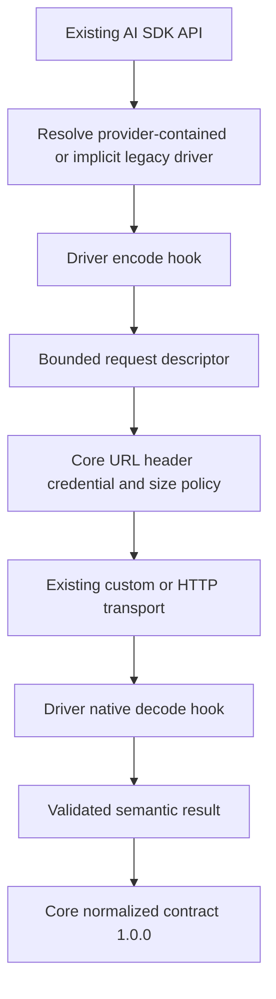

# Kujo AI SDK Provider Driver Implementation Report

## Summary

The AI SDK now has an additive, independently versioned provider-driver boundary. Existing providers and applications remain unchanged and implicitly use the built-in OpenAI-compatible driver. Explicit native drivers can encode provider-specific requests and decode chat, stream, embedding, and error payloads while core retains network execution, policy, operations, and normalized contract ownership.

## Architecture Implemented



Drivers perform no I/O. Core continues to own retries, budgets, jitter, timeouts, deadlines, circuit breakers, fallbacks, governance, concurrency, state, hooks, tracing, fixtures, transport selection, endpoint/header security, response-size enforcement, redaction, structured-output validation, retryability, and final contract assembly.

## Files Created

| Path | Visibility | Purpose / important symbols |
|---|---|---|
| `src/provider_driver.kujo` | Public Kennel export | `provider_driver_contract_version`, validation, safe metadata hooks, implicit resolution |
| `src/openai_compatible_driver.kujo` | Public Kennel export | Reusable built-in descriptor driver and exported OpenAI encode hooks |
| `tests/fixtures/fictional_provider_driver.kujo` | Test-only | Deterministic native fictional protocol |
| `tests/fixtures/provider_driver_security_fixture.kujo` | Test-only | Malicious descriptor/decoder variants |
| `tests/provider_driver_contract_tests.kujo` | Test | Version, validation, operation pairing, legacy and explicit resolution |
| `tests/openai_compatible_driver_regression_tests.kujo` | Test | OpenAI/OpenRouter/DeepSeek/custom and embeddings parity |
| `tests/external_driver_fixture_tests.kujo` | Test | Native auth/body/response/error/stream/embeddings proof |
| `tests/provider_driver_security_tests.kujo` | Test | Host/scheme/credential/header/size/exception/retry containment |
| `AI_SDK_PROVIDER_DRIVER_IMPLEMENTATION_REPORT.md` | Public artifact | Implementation, compatibility, and validation record |

## Files Modified

- `src/ai_sdk.kujo`: resolves drivers, validates descriptors, dispatches native decoders, validates semantic results, and preserves core operations.
- `src/providers.kujo`: retains localhost opt-in as additive provider metadata for final descriptor validation.
- `kennel.toml`: adds `driver` and `openai_compatible_driver` exports; existing exports remain.
- `scripts/release_quality_gates.sh`: adds all four driver suites and raises the aggregate floor.
- `README.md`, `CHANGELOG.md`, and the reviewed provider, architecture, adoption, policy, production, compatibility, and telemetry docs: document the public extension and trust boundary.

## Public APIs Added

- `provider_driver_contract_version()`
- `validate_provider_driver(driver, provider)`
- `safe_driver_describe(driver, provider)`
- `safe_driver_validate(driver, provider)`
- `resolve_provider_driver(provider)`
- `openai_compatible_driver()` and its public descriptor encode helpers

## Existing APIs Preserved

All prior AI SDK and provider exports, arguments, provider/client fields, option names/defaults, low-level OpenAI normalization/parser/header/retry helpers, custom transport signature and precedence, normalized result/error fields, buffered stream events, model preferences, and model catalog behavior remain in place. The normalized response contract remains `1.0.0`.

## Driver Contract

Required fields are `contract: "ai-sdk-provider-driver"`, `version: "1.0.0"`, non-empty `id`, and callable `describe`, `validate`, `encode_chat`, `decode_chat`, and `decode_error`. Streaming capability requires `decode_stream`. Embeddings capability requires paired `encode_embeddings` and `decode_embeddings`.

Encode context contains operation, provider, a scoped credential, normalized payload/messages/input, original options, and resolved options. The hook returns `{url, method, headers, protected_headers, body, stream_mode}`. Decode hooks receive bounded response status/body/data/chunks and return semantic chat, embeddings, stream, or error data. Core validates both boundaries.

## OpenAI-Compatible Driver

Legacy providers resolve to `openai-compatible` and retain Bearer authentication, configured chat/embedding paths, JSON bodies, OpenAI chat/embedding/error shapes, SSE helpers, usage aliases, tool calls, fixtures, and existing normalizers. Compatibility is protected by the original suites and the new preset/custom regression suite.

## Legacy Resolution

`create_client` resolves an explicit provider `driver` when present. Otherwise it validates and attaches the built-in OpenAI-compatible driver with `driver_source: "legacy_openai_compatible"`. Existing provider dictionaries need no new field or caller change.

## Non-OpenAI Fixture

The fictional provider uses `x-api-key`, `application/fictional+json`, `engine` plus `conversation[{speaker,text}]`, `reply.text`, `metrics{input,output}`, `failure{reason,code}`, pipe-delimited native stream frames, and `vectors[{position,values}]`. All map into the unchanged Kujo chat/error/stream/embedding contracts offline.

## Security Boundary

Core rejects driver-selected host changes, remote HTTP, URL credentials/query/fragments, malformed descriptor types/methods, CR/LF headers, credential placement outside protected headers, and oversized bodies/chunks. It protects case-insensitive auth/content headers, contains hook exceptions, validates semantic results, redacts raw data, and ignores driver retry hints for terminal status classes. Drivers cannot choose or execute transport.

## Tests Added

- Contract tests: 5/5.
- OpenAI regression tests: 4/4.
- External fictional-driver tests: 5/5.
- Malicious-driver tests: 8/8.

## Existing Tests

The release gate passed 136 tests: driver contract 5/5, OpenAI regression 4/4, external fixture 5/5, malicious-driver security 8/8, SDK contract 31/31, resilience 40/40, embeddings 14/14, security redaction 3/3, reliability 9/9, parser 3/3, feature 3/3, bugfix 10/10, and live-provider policy 1/1 (credential-free skip path), plus schema fixtures, examples, and benchmark quality thresholds. Model catalog, model-preference, telemetry, and supply-chain checks remained unchanged and passed in final validation.

## Downstream Compatibility

- Agents SDK: AI adapter 11/11, error model 5/5, runner event contract 2/2, integration adapters 9/9, and basic runner 25/25 passed.
- Dispatch: SDK adapter 10/10 and routing/model-catalog 31/31 passed.
- AI Chat: direct offline `bridge_chat.kujo` against the changed SDK passed with normalized contract 1.0.0. Its broad Node suite is independently blocked on the checkout's `better-sqlite3` ABI, unrelated to this change.
- Relay: input-boundary smoke and the full interpreter contract run passed.
- Tribunal: the direct offline AI SDK bridge passed; the broad repository suite continues to emit pre-existing runtime feature warnings unrelated to this change.
- RAG and Watchdog: organization audit found structural normalized-result/proxy coupling but no direct driver-private import; original AI SDK contract/telemetry gates cover those boundaries.
- Kujo workflows: the AI SDK benchmark request fixture passed and produced the expected response acknowledgement; its script emitted pre-existing `env_int`/`env_float` arity warnings.

## Regressions Found

During extraction, hand-authored providers without optional `models` metadata initially failed driver description. The built-in description was made safely additive. Flat `AI_SDK_PATH=.../src` consumers initially could not resolve `src.*` internal imports; driver imports were corrected to package-relative flat imports and AI Chat bridge validation then passed. No public behavior change was retained.

## Remaining Unknowns

Runtime redirect control, true incremental transport chunks, signed requests, and query authentication remain explicitly out of scope. Query strings are rejected by the current descriptor boundary. No production native provider package is included.

## Documentation Updated

README, changelog, API contract policy, architecture/data flow, first-provider guide, provider extension guide, compatibility matrix, adoption guide, production runbook, and telemetry guide now distinguish OpenAI-compatible providers from native drivers and document the public hooks and security boundary.

## Driver Authoring Example

```kujo
from provider_driver import provider_driver_contract_version

driver := {
  "contract": "ai-sdk-provider-driver",
  "version": provider_driver_contract_version(),
  "id": "example-native",
  "describe": func(provider) { return {"auth": {"mode": "header"}} },
  "validate": func(provider) { return {"ok": true, "errors": []} },
  "encode_chat": func(context) {
    return {"url": context["provider"]["base_url"] + "/messages", "method": "POST", "headers": {"x-api-key": context["credential"]}, "protected_headers": ["x-api-key"], "body": to_json({"conversation": context["messages"]}), "stream_mode": false}
  },
  "decode_chat": func(context) { return {"ok": true, "request_id": "", "model": context["fallback_model"], "output_text": context["data"]["reply"], "finish_reason": "stop", "tool_calls": [], "usage": {"input_tokens": 0, "output_tokens": 0, "total_tokens": 0}, "raw_provider": context["data"]} },
  "decode_error": func(context) { return {"ok": false, "matched": false} }
}
```

## Ready for First Provider Package?

YES
