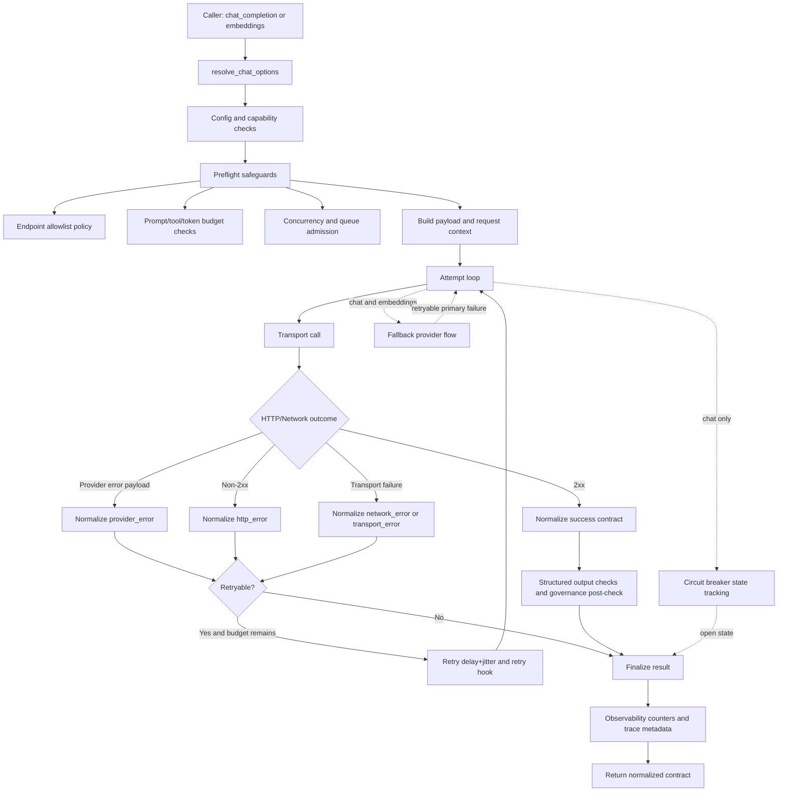

# Kujo AI SDK Architecture and Data Flow

This document explains how requests move through Kujo AI SDK and where reliability, safety, and normalization controls are applied.

## System Components

- `src/providers.ruff`: provider presets and custom endpoint validation.
- `src/ai_sdk.ruff`: request execution engine, normalization, retries, budgets, breaker, fallback, and observability.
- `examples/*.ruff`: runnable usage profiles.
- `tests/*.ruff`: contract and failure-mode validation.

## End-to-End Request Lifecycle

## Data-Flow Narrative

1. Option resolution:
   The SDK merges caller options with defaults from `default_limits()` and builds a single resolved-options map.

2. Preflight policy enforcement:
   The SDK validates provider config, endpoint allowlist policy, and budget constraints before costly work.

3. Request preparation:
   Payload and transport context are prepared once per request path and reused across retries where possible.

4. Attempt execution:
   Each attempt emits start/complete observability hooks (when configured), executes transport, and normalizes responses.

5. Retry and failover:
   Retryable outcomes follow bounded retry policy (`max_retries`, `retry_budget`, delay/jitter controls). Fallback providers are attempted only after retryable primary failure conditions.

6. Governance and completion:
   Post-response governance checks enforce rolling/request budgets. Final result includes normalized contract fields plus observability counters and trace metadata.

## Reliability and Safety Controls

- Retry controls: `max_retries`, `retry_budget`, `retry_delay_ms`, `max_retry_delay_ms`, `retry_jitter_ms`.
- Deadline controls: `overall_timeout_ms`, `deadline_ms` (chat and embeddings).
- Breaker controls (chat): threshold, cooldown, half-open behavior, optional shared state backend.
- Budget controls: prompt/tool/token/cost constraints with deterministic normalized failures.
- Endpoint controls: strict custom URL validation plus optional host allowlist policy mode.

## Normalized Contract Boundaries

- All success/error responses are normalized into stable contract shape.
- Provider raw payloads are redacted before returning to callers.
- Observability metadata is attached for deterministic telemetry integration.

## Operational Guidance

- Use fixture mode for deterministic local/CI execution.
- Keep retry budgets small in deployed environments to avoid amplification under provider incidents.
- Enable endpoint allowlist mode for controlled outbound access.
- Treat this diagram as the canonical high-level flow for future feature additions.
